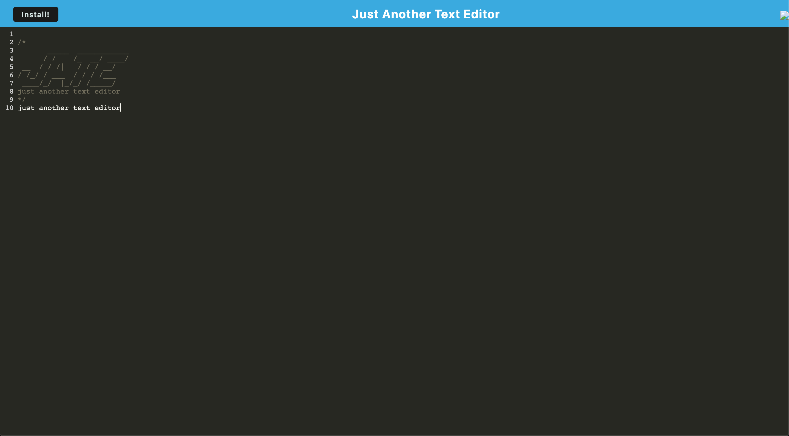

# PWA Text Editor
## Description
This is a Progressive Web Application Text Editor. Using a combination of webpack, service workers, and manifest.json, this is a simple application which can be downloaded and used offline.
## Installation
To install this app, clone this repo, then open in your preferred IDE.

Next, in the app's root directory, run:
```
npm install
```
to install all necessary dependencies.

## Usage
To use this app, in the app's root directory, run:
```
npm run start:dev
```

this will run webpack to pack up the application and load it up on a local server, with the port of '9005', unless this was changed.

If you want to install this application locally, you can click 'install' in the top left corner, and will be prompted to install the app.
## Sample image of app


## Links
Link to deployed app on heroku: [here](https://jate-tai.herokuapp.com/)

Link to my github: [here](https://github.com/taicedtea)